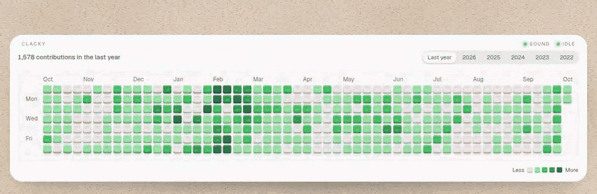
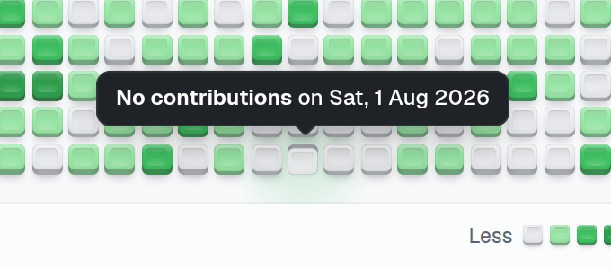
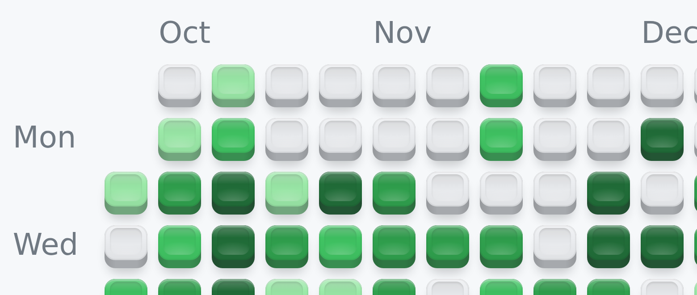
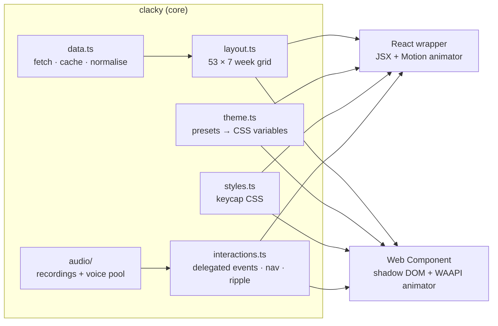
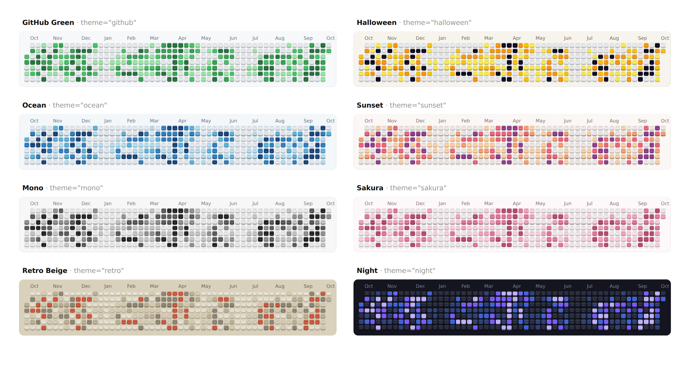
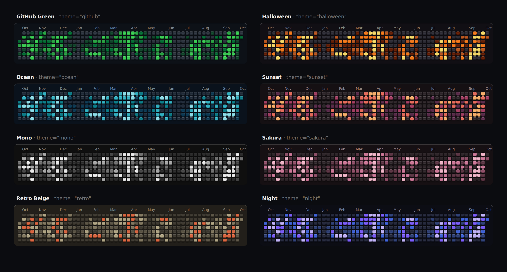

<div align="center">

<!--
  Demo recording. To refresh it, record the demo site (apps/demo) and replace
  .github/assets/demo.gif (~880px wide, under 4 MB) and demo.mp4.
-->
<a href="https://github.com/Rishabjs03/keyboard-graph#readme">
  
</a>

<h1>⌨️ clacky</h1>

<p><b>Your GitHub contribution graph as a grid of clickable mechanical keycaps.</b><br/>
Every day is a key. Press one: it travels down, springs back, clicks like a real switch, and tells you what you shipped.</p>

<p>
  <a href="https://www.npmjs.com/package/clacky"></a>
  <a href="https://bundlephobia.com/package/clacky"></a>
  <a href="./LICENSE"></a>
  
  
</p>

<p>
  <a href="#-quick-start"><b>Quick start</b></a> ·
  <a href="#-props--attributes"><b>Props</b></a> ·
  <a href="#-theming"><b>Theming</b></a> ·
  <a href="#-sound"><b>Sound</b></a> ·
  <a href="#-self-hosted-proxy"><b>Proxy</b></a> ·
  <a href="./apps/demo"><b>Demo site</b></a>
</p>

</div>

---

## ✨ Highlights

|                               |                                                                                                                                                  |
| ----------------------------- | ------------------------------------------------------------------------------------------------------------------------------------------------ |
| 🎹 **Real keycaps, pure CSS** | Concave dish, side skirt, specular highlight, soft drop shadow. No images, no canvas, no WebGL.                                                  |
| 🪀 **Tactile press**          | The key bottoms out in 55 ms, then a physically simulated spring returns it with a hint of overshoot. Neighbours dip and glow in sympathy.       |
| 🔊 **Switch sounds**          | Blue (clicky), Brown (tactile), Red (linear) and Cream (deep thock): **real keyboard recordings** (CC0), separate press and release clips.       |
| 🎨 **8 themes + your own**    | Presets with light and dark palettes, a `theme` object, or plain CSS custom properties. Theme changes ripple across the keys as a wave.          |
| ♿ **Accessible**             | Arrow-key navigation, Enter/Space presses, screen-reader labels, a visible focus ring, and `prefers-reduced-motion` support.                     |
| ⚡ **Fast**                   | About 370 keys, **7 delegated listeners**, and presses that animate only `transform`/`opacity` on the compositor. Presses never re-render React. |
| 🧩 **Works everywhere**       | A React component **and** a framework-free `<clacky-graph>` custom element (Astro, Vue, Svelte, plain HTML). SSR-safe. ESM + CJS + types.        |
| 🔌 **Bring your own data**    | By username (no token needed), your own endpoint or fetcher, or a static `data` array. Includes a self-hosted GitHub GraphQL proxy helper.       |

<p align="center">
  
  &nbsp;&nbsp;
  
</p>

---

## 📦 Install

```bash
npm install clacky motion     # React (Motion powers the React animations)
npm install clacky            # Web Component only: no other dependencies
```

<details>
<summary>pnpm / yarn / bun / CDN</summary>

```bash
pnpm add clacky motion
yarn add clacky motion
bun add clacky motion
```

```html
<!-- No build step: one script tag registers <clacky-graph> -->
<script src="https://unpkg.com/clacky/dist/clacky.iife.js"></script>
```

</details>

**Entry points**

| Import           | What you get                                                                    | Size (min + gzip)         |
| ---------------- | ------------------------------------------------------------------------------- | ------------------------- |
| `clacky/react`   | `<Clacky />`, `useContributions()`                                              | ~18 kB + `motion` (peer)  |
| `clacky/element` | Registers `<clacky-graph>` on import                                            | ~19 kB, zero dependencies |
| `clacky`         | Framework-agnostic core: data, layout, themes, styles, audio, interactions      | tree-shakeable            |
| `clacky/server`  | `fetchGitHubContributions()`, `createContributionsHandler()` for your own proxy | ~1.6 kB                   |

Sizes include the stylesheet. Each switch's sounds are a separate ~14 to 22 kB (gzip) chunk, loaded only when used.

---

## 🚀 Quick start

### React

```tsx
import { Clacky } from 'clacky/react';

export function Contributions() {
  return (
    <Clacky
      username="Rishabjs03"
      theme="ocean"
      sound="blue"
      onKeyPress={(day) => console.log(`${day.count} contributions on ${day.date}`)}
    />
  );
}
```

> The component is marked `'use client'`, so you can render it straight from a Next.js Server Component. Styles are injected for you (React 19 hoists them into `<head>`, including during SSR).

### Plain HTML (Web Component)

```html
<script src="https://unpkg.com/clacky/dist/clacky.iife.js"></script>

<clacky-graph username="Rishabjs03" theme="ocean" sound="blue" year-selector></clacky-graph>

<script>
  document
    .querySelector('clacky-graph')
    .addEventListener('clacky-keypress', (event) => console.log(event.detail));
</script>
```

### Astro, Vue, Svelte, or anything with a bundler

```js
import 'clacky/element'; // registers <clacky-graph> (safe to import on the server)
```

```astro
---
// Astro
---
<clacky-graph username="Rishabjs03" theme="sakura"></clacky-graph>
<script>import 'clacky/element';</script>
```

```vue
<!-- Vue: tell the compiler it's a custom element -->
<!-- vite.config: vue({ template: { compilerOptions: { isCustomElement: (t) => t === 'clacky-graph' } } }) -->
<template>
  <clacky-graph username="Rishabjs03" theme="night" color-scheme="dark" />
</template>
<script setup>
import 'clacky/element';
</script>
```

```svelte
<script>
  import 'clacky/element';
</script>

<clacky-graph username="Rishabjs03" theme="retro" on:clacky-keypress={(e) => console.log(e.detail)} />
```

---

## 🧠 How it works

The library is split into a **framework-agnostic core** and two **thin wrappers**. Both wrappers render the
same DOM, use the same stylesheet, and hand the grid to the same interaction controller. Only the
animation engine differs.



1. **Data**: contributions are fetched (or taken from `data`), sorted, gap-filled, and bucketed into levels 0 to 4 (GitHub's quartile method when levels are missing).
2. **Layout**: each day gets a `col` (week) and `row` (weekday), exactly like GitHub's calendar, with month and weekday labels.
3. **Render**: each key is a `<button>` with three spans: a shadow, a skirt (the side wall) and a cap (the top, with a concave dish drawn with gradients). Colours come from CSS variables, so themes are just variable swaps.
4. **Size**: key size is solved in CSS with container query units (`100cqi / columns`). The graph shrinks to fit its container, then scrolls with snap on very small screens. There's no JS measuring.
5. **Interact**: seven listeners on the grid (not one per key) drive presses, keyboard navigation and tooltips. Presses animate imperatively, so React never re-renders on a keypress.
6. **Animate**: the web component plays spring curves baked into WAAPI keyframes (compositor-thread). The React wrapper uses [Motion](https://motion.dev), which hands springs to the browser as hardware-accelerated `linear()` curves.
7. **Sound**: the selected switch's recordings (a small MP3 sprite) load lazily and are decoded once. On the first user gesture an `AudioContext` is created, and strokes play through a fixed pool of voices with a random sample, pitch and gain.

---

## ⚙️ Props / attributes

Every option works as a React prop **and** as a Web Component attribute (kebab-case) or property.

### Data

| Prop (React)   | Attribute       | Type                                         | Default    | Description                                                                                       |
| -------------- | --------------- | -------------------------------------------- | ---------- | ------------------------------------------------------------------------------------------------- |
| `username`     | `username`      | `string`                                     | none       | GitHub username to fetch.                                                                         |
| `year`         | `year`          | `number \| 'last'`                           | `'last'`   | A calendar year, or the rolling last 12 months.                                                   |
| `data`         | `data` (JSON)   | `{ date, count, level? }[]`                  | none       | Static data. Skips fetching (great for SSR/SSG). Missing days are filled in.                      |
| `fetcher`      | _property only_ | `({ username, year, signal }) => Promise<…>` | none       | Your own data source. Return a day array or `{ contributions }`.                                  |
| `endpoint`     | `endpoint`      | `string`                                     | public API | URL template with `{username}` and `{year}`, returning the default API's shape (e.g. your proxy). |
| `yearSelector` | `year-selector` | `boolean \| YearSelection[]`                 | `false`    | Built-in year switcher (last year + past 5 years, or your list).                                  |
| `weekStart`    | `week-start`    | `0 \| 1`                                     | `0`        | Sunday (GitHub) or Monday.                                                                        |

### Appearance

| Prop              | Attribute           | Type                          | Default    | Description                                                     |
| ----------------- | ------------------- | ----------------------------- | ---------- | --------------------------------------------------------------- |
| `theme`           | `theme`             | preset name \| `CustomTheme`  | `'github'` | See [Theming](#-theming). The attribute also accepts JSON.      |
| `colorScheme`     | `color-scheme`      | `'light' \| 'dark' \| 'auto'` | `'light'`  | `auto` follows the OS.                                          |
| `keySize`         | `key-size`          | `number` (px)                 | `16`       | Maximum key size. Keys shrink to fit narrow containers.         |
| `gap`             | `gap`               | `number` (px)                 | `4`        | Gap between keys at full size (scales with the keys).           |
| `radius`          | `radius`            | `number` (px)                 | `4`        | Corner radius at full size.                                     |
| `minKeySize`      | `min-key-size`      | `number` (px)                 | `9`        | Below this the graph scrolls horizontally instead of shrinking. |
| `responsive`      | `responsive`        | `'scale' \| 'scroll'`         | `'scale'`  | `scroll` keeps full-size keys and scrolls with snap.            |
| `showMonthLabels` | `show-month-labels` | `boolean`                     | `true`     |                                                                 |
| `showDayLabels`   | `show-day-labels`   | `boolean`                     | `true`     | Mon / Wed / Fri.                                                |
| `showTotal`       | `show-total`        | `boolean`                     | `true`     | "1,578 contributions in the last year".                         |
| `showLegend`      | `show-legend`       | `boolean`                     | `true`     | "Less ▢▢▢▢▢ More", drawn with mini keycaps.                     |
| `plate`           | `plate`             | `boolean`                     | `true`     | The background plate the keys sit on.                           |

### Sound

| Prop     | Attribute | Type                                                          | Default   | Description                                                   |
| -------- | --------- | ------------------------------------------------------------- | --------- | ------------------------------------------------------------- |
| `sound`  | `sound`   | `'blue' \| 'brown' \| 'red' \| 'cream' \| SoundPack \| false` | `'brown'` | Switch profile, your own samples, or silence (`sound="off"`). |
| `volume` | `volume`  | `number` (0 to 1)                                             | `0.5`     |                                                               |
| `muted`  | `muted`   | `boolean`                                                     | `false`   |                                                               |

### Motion & behaviour

| Prop              | Attribute          | Type                                       | Default  | Description                                                                   |
| ----------------- | ------------------ | ------------------------------------------ | -------- | ----------------------------------------------------------------------------- |
| `entrance`        | `entrance`         | `boolean`                                  | `true`   | Keys drop into the plate in a diagonal wave when the graph scrolls into view. |
| `ripple`          | `ripple`           | `boolean`                                  | `true`   | Neighbours dip and an underglow radiates through the gaps on press.           |
| `tooltip`         | `tooltip`          | `boolean`                                  | `true`   | Popover on press / keyboard focus. Never clips: it lives in the top layer.    |
| `themeTransition` | `theme-transition` | `boolean \| { origin, duration, stagger }` | `true`   | Colour changes sweep across the keys from `origin` (viewport point).          |
| `ghostTyping`     | `ghost-typing`     | `boolean \| { interval, burst }`           | `false`  | Idle keys press themselves softly; stops on the first real interaction.       |
| `reducedMotion`   | `reduced-motion`   | `'user' \| 'always' \| 'never'`            | `'user'` | `user` follows `prefers-reduced-motion`.                                      |
| `locale`          | `locale`           | `string`                                   | none     | BCP 47 locale for dates and numbers.                                          |
| `formatTooltip`   | _property only_    | `(day) => string`                          | none     | Custom tooltip text.                                                          |
| `formatAriaLabel` | _property only_    | `(day) => string`                          | none     | Custom screen-reader label.                                                   |
| `formatTotal`     | _property only_    | `(total, year) => string`                  | none     | Custom total line.                                                            |

### Events

| React          | Web Component event | Payload                                                                      |
| -------------- | ------------------- | ---------------------------------------------------------------------------- |
| `onKeyPress`   | `clacky-keypress`   | `{ date, count, level, col, row, source }`                                   |
| `onLoad`       | `clacky-load`       | `{ days, total, year, username }`                                            |
| `onError`      | `clacky-error`      | `ClackyError` (`code`: `not-found` · `rate-limited` · `network` · `invalid`) |
| `onYearChange` | `clacky-yearchange` | `{ year }`                                                                   |

### Imperative API

Available on a React `ref` and as methods on the element.

```tsx
const graph = useRef<ClackyHandle>(null);
<Clacky ref={graph} username="Rishabjs03" />;

graph.current.press('2026-08-12'); // press a day by date (or index)
graph.current.pressAt(10, 3, { sound: true }); // press by column (week) / row (weekday)
graph.current.focusDay('2026-08-12'); // move keyboard focus
graph.current.replayEntrance(); // replay the drop-in wave
graph.current.getDays(); // ContributionDay[]
```

`press` options: `{ sound?, tooltip?, soft?, notify?, hold? }`.

---

## 🎨 Theming

<p align="center">
  
  
</p>

**Presets:** `github` · `halloween` · `ocean` · `sunset` · `mono` · `sakura` · `retro` (classic beige keyboard) · `night`. Each has a light and a dark palette.

### 1. A preset

```tsx
<Clacky username="Rishabjs03" theme="retro" colorScheme="auto" />
```

### 2. A custom theme object

Override any colour of a preset. Top-level values apply to both schemes; `dark` overrides dark mode only.

```tsx
<Clacky
  username="Rishabjs03"
  theme={{
    extends: 'mono',
    levels: ['#eef2ff', '#c7d2fe', '#818cf8', '#4f46e5', '#312e81'], // level 0 → 4
    side: '#1e1b4b', // mixed into each cap colour to shade its side walls
    shadow: 'rgba(30, 27, 75, .3)',
    plate: '#f8faff', // background plate
    text: '#4c4f6b', // labels, legend, totals
    focus: '#4f46e5', // keyboard focus ring
    highlight: 0.35, // strength of the glossy highlight (0 to 1)
    tooltip: { background: '#1e1b4b', text: '#fff', border: 'transparent' },
    dark: { plate: '#0b0b1a', levels: ['#1c1b33'] },
  }}
/>
```

```html
<clacky-graph
  theme='{"extends":"ocean","levels":["#eee","#cde","#9bd","#59b","#246"]}'
></clacky-graph>
```

### 3. Plain CSS custom properties

The variables inherit through the shadow DOM, so this works for both the element and the React component:

```css
clacky-graph,
.clacky-root {
  --clacky-level-0: #eceff4; /* override in both schemes… */
  --clacky-level-4: #5e81ac;
  --clacky-dark-plate: #2e3440; /* …or in one scheme only: --clacky-light-* / --clacky-dark-* */
  --clacky-font: 'Inter', sans-serif;
}
```

| Variable                                                                    | Controls                                |
| --------------------------------------------------------------------------- | --------------------------------------- |
| `--clacky-level-0` … `--clacky-level-4`                                     | Keycap colours per contribution level   |
| `--clacky-side`                                                             | Colour mixed in to shade the side walls |
| `--clacky-shadow`                                                           | Drop shadow under each key              |
| `--clacky-plate`                                                            | Background plate                        |
| `--clacky-text`                                                             | Labels, totals, legend                  |
| `--clacky-focus`                                                            | Focus ring                              |
| `--clacky-highlight`                                                        | Gloss strength (0 to 1)                 |
| `--clacky-tooltip-bg` · `--clacky-tooltip-text` · `--clacky-tooltip-border` | Tooltip                                 |
| `--clacky-font`                                                             | Font stack                              |

Precedence: `--clacky-<token>` (CSS) › `theme` prop › preset defaults. The element also exposes
`::part(root | plate | grid | key | tooltip | total | year)` for structural styling.

---

## 🔊 Sound

| Profile | Switch (recording)                    | What you hear                                                      |
| ------- | ------------------------------------- | ------------------------------------------------------------------ |
| `blue`  | Kailh Box Jade, clicky                | A crisp, bright click on the way down and a sharp tick on release. |
| `brown` | Cherry MX Brown on a Kinesis, tactile | A muted bump and a clean bottom-out. _(default)_                   |
| `red`   | Linear switches, clacky               | A smooth, plasticky clack with a light top-out.                    |
| `cream` | A thocky custom board                 | The deepest, roundest "thock" of the four.                         |

**Real recordings.** Every sound is a real keystroke from a real mechanical keyboard, cut from
recordings released under **CC0 (public domain)** on Freesound. The recordists and links are in
[`sounds/SOURCES.md`](./packages/clacky/sounds/SOURCES.md). Each profile is 6 presses and 4 releases packed into one
~20 kB MP3 sprite, picked by a script for sharp onsets, single clean hits and a consistent tone.

**Loading.** Each profile is its own lazily loaded chunk, so a page only downloads the switch it uses
(after the first interaction, or ahead of time in the background). It is decoded once with an
`OfflineAudioContext` and shared by every graph on the page. The CDN `<script>` build fetches the
same sprite from jsDelivr instead of inlining all four, and falls back to unpkg if jsDelivr errors or
stalls for 6 seconds.

**Playback.** A fixed pool of 12 voices plays strokes with a random sample (never the same one twice
in a row), **±35 cents of detune** and **±7% gain**, so rapid typing never sounds robotic, never piles
up, and never cuts off abruptly (a stolen voice fades out in 4 ms). Presses and releases are separate
recordings, played on pointer/key down and up.

**Autoplay rules.** The `AudioContext` is created on the first real user gesture (pointer or key)
inside the graph, never on page load.

**Your own samples:**

```tsx
<Clacky
  username="Rishabjs03"
  sound={{ down: ['/sounds/down-1.wav', '/sounds/down-2.wav'], up: ['/sounds/up-1.wav'] }}
/>
```

Samples are fetched and decoded once (with an `OfflineAudioContext`, so before any gesture) and cached.

---

## 🛰️ Data sources

| Mode                   | Example                                                                  | Needs a token? |
| ---------------------- | ------------------------------------------------------------------------ | -------------- |
| Username (default API) | `<Clacky username="octocat" />`                                          | No             |
| Your endpoint          | `endpoint="/api/contributions/{username}?y={year}"`                      | Server-side    |
| Custom fetcher         | `fetcher={({ username, year, signal }) => fetch(…).then(r => r.json())}` | Up to you      |
| Static data            | `data={[{ date: '2026-08-12', count: 12 }]}`                             | No             |

Responses are cached in memory per URL (switching years back and forth never refetches), requests are
aborted when props change, and stalled requests time out after 15 s with a **Try again** button.

**States:** loading shows shimmering skeleton keys; errors show a message on the plate (with retry);
a user with no contributions still gets a full, blank keyboard.

---

## 🔐 Self-hosted proxy

For production traffic, or to avoid depending on a community service, run your own tiny proxy that
talks to **GitHub's GraphQL API** with your token. `clacky/server` does the work:

```ts
// app/api/contributions/[username]/route.ts (Next.js)
import { createContributionsHandler } from 'clacky/server';

export const GET = createContributionsHandler(); // reads process.env.GITHUB_TOKEN
```

```tsx
<Clacky username="octocat" endpoint="/api/contributions/{username}?y={year}" />
```

Ready-made examples: [Vercel Function](./examples/proxy-vercel) · [Netlify Function](./examples/proxy-netlify).
The handler validates usernames, adds CORS headers, maps errors to proper status codes, and sets
`s-maxage=3600, stale-while-revalidate` so your CDN absorbs repeat traffic.

**Which token?** A [fine-grained personal access token](https://github.com/settings/personal-access-tokens/new)
with **no repository access and no permissions** is enough for public contribution data. Keep it
server-side only (an environment variable such as `GITHUB_TOKEN`). Never ship it to the browser.

Need the data elsewhere? `fetchGitHubContributions({ token, username, year })` returns
`{ total, contributions }` and works in any runtime with `fetch` (Node 18+, Deno, Bun, Workers).

---

## ♿ Accessibility

| Key                   | Action                                                           |
| --------------------- | ---------------------------------------------------------------- |
| `Tab`                 | Enter the grid (lands on today)                                  |
| `←` / `→`             | Previous / next week                                             |
| `↑` / `↓`             | Previous / next day                                              |
| `PageUp` / `PageDown` | Four weeks back / forward                                        |
| `Home` / `End`        | First / last day in the row (`Ctrl`/`⌘`: first/last day overall) |
| `Enter` / `Space`     | Press the key (with sound and animation)                         |
| `Esc`                 | Hide the tooltip                                                 |

- Every key is a real `<button>` labelled like _"12 contributions on August 12, 2026"_. Roving `tabindex` keeps the grid a single tab stop.
- Screen-reader "clicks" (which fire no key or pointer events) still press the key.
- A visible focus ring, and a live region that announces loading results.
- `prefers-reduced-motion`: presses become simple fades, the entrance wave, ripples and ghost typing are disabled, and colour changes are instant.

## ⚡ Performance

- **7 listeners total**, delegated on the grid, instead of one per key.
- Presses, ripples and the entrance wave animate only `transform` and `opacity`. Springs are pre-sampled, so the browser runs them off the main thread.
- Pressing a key never triggers a React render; the ~370 keys are rendered once and memoised.
- No layout reads in hot paths. Sizing is pure CSS (container query units), so there's no `ResizeObserver` loop.
- The entrance wave waits until the graph is on screen; ghost typing pauses when off-screen or in a background tab.

## 🖥️ SSR & browser support

- Nothing touches `window`/`document` at import time. `clacky/element` only registers in the browser.
- With `data`, the React component server-renders the full keyboard (hidden until the entrance wave runs, with a CSS failsafe if JavaScript never loads).
- Evergreen browsers: **Chrome/Edge 111+, Safari 16.4+, Firefox 113+** (uses `color-mix()`, container query units and WAAPI). The tooltip uses the Popover API where available and falls back to fixed positioning.

---

## ⚠️ Third-party limits & licensing

Please read this before shipping to production.

- **Default contributions API** (`github-contributions-api.jogruber.de`): a free, open-source, community-run service ([source](https://github.com/grubersjoe/github-contributions-api)) that scrapes the public contribution calendar. It needs no token, but it has **no SLA and no published rate limit**, and it caches responses for about an hour. It's ideal for portfolios and demos; for high traffic, use the [self-hosted proxy](#-self-hosted-proxy) (or at least your own CDN in front). It only sees what your public profile shows, so private contributions appear only if you enabled _"Include private contributions"_ on your profile.
- **GitHub GraphQL API** (proxy mode): 5,000 points per hour per token, and each request costs ~1 point. GitHub also applies secondary rate limits to bursts. A `contributionsCollection` covers at most one year, which matches what the component asks for. With CDN caching (`s-maxage=3600`) this comfortably serves large sites.
- **Sounds**: cut from four recordings released under **CC0 1.0** (public domain) on Freesound by el_boss, DarcyConroy, samchitto and aliyahb. CC0 allows copying, modifying and redistributing, commercially included, with no attribution required (credit is given anyway in [`sounds/SOURCES.md`](./packages/clacky/sounds/SOURCES.md)). If you pass your own `SoundPack`, make sure you have the rights to those files (Freesound's CC0 filter is a good source).
- **CDN build and sounds**: the `<script>` (IIFE) build loads the selected switch's sprite from `cdn.jsdelivr.net`, with `unpkg.com` as a fallback. If your site's Content Security Policy blocks those hosts, use the npm package (sounds are bundled) or add them to `connect-src`.
- **Dependencies**: Motion (MIT) is an optional peer dependency for the React wrapper only. The demo uses Next.js (MIT), Tailwind CSS (MIT), sugar-high (MIT), and the Geist font (SIL Open Font License).

---

## 🗂️ Repository

```
.
├── packages/clacky   # the library (published to npm)
│   ├── src/core              # data, layout, theme, styles, springs, interactions, tooltip
│   ├── src/audio             # switch recordings loader + Web Audio voice pool
│   ├── sounds                # CC0 recording sprites + SOURCES.md
│   ├── src/react             # <Clacky> + Motion animator + useContributions
│   ├── src/element           # <clacky-graph> custom element (WAAPI animator)
│   ├── src/server            # GitHub GraphQL helper + Fetch-API proxy handler
│   └── test                  # Vitest unit tests
├── apps/demo                 # Next.js (App Router) + Tailwind + Motion showcase site
└── examples                  # plain HTML, Vercel and Netlify proxies
```

```bash
pnpm install
pnpm dev          # builds the library, then runs the library watcher + demo at http://localhost:3000
pnpm test         # unit tests
pnpm lint && pnpm typecheck
pnpm build        # library (ESM + CJS + IIFE + types) and demo
```

Deploying the demo to Vercel: import the repo, set the root directory to `apps/demo`, and optionally
add `GITHUB_TOKEN` to use GitHub's API directly (without it, the demo proxies the public API).

## 🤝 Contributing

Issues and PRs are welcome. See [CONTRIBUTING.md](./CONTRIBUTING.md).

## 📄 License

[MIT](./LICENSE) © [Rishab Agarwal](https://x.com/Yrishavjs)

<div align="center"><sub>Made by Rishab · <a href="https://x.com/Yrishavjs">@Yrishavjs</a></sub></div>
